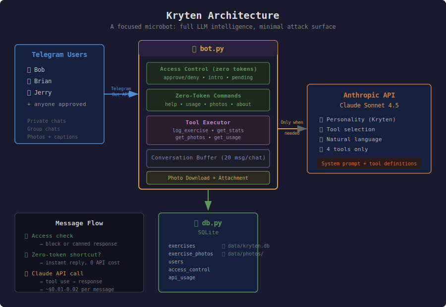

# Kryten 🤖

> **Disclaimer:** This project is not affiliated with the BBC in any way whatsoever.
> The naming is simply an homage to the creative works owned by the BBC.

Kryten is a **focused microbot** — a pattern for building real-world natural
language applications by pairing a full LLM with a deliberately small set of
tools. It demonstrates how to get the intelligence of a frontier model (Claude
Sonnet 4.5) while keeping costs low, the attack surface minimal, and the
behavior predictable.

The approach: give the LLM a personality, a clear job, and only the tools it
needs. Let it handle all the messy natural language understanding — "Brian and
I walked 4 miles in the snow" — while the application controls exactly what
actions are possible.

In this case, the personality is
[Kryten from Red Dwarf](https://www.youtube.com/watch?v=8525OKIhwqk) and the
job is fitness tracking over Telegram. But the pattern applies to any domain
where you want natural language input driving a constrained set of operations.



### The Balance

- **Capability**: Claude handles natural language understanding, personality,
  context, and deciding which tool to call. You get the full power of a frontier
  model for interpreting freeform human input and turning it into structured data.
- **Cost**: Most interactions cost $0.01-0.02. Zero-token shortcuts (help,
  usage, photos, access control) cost nothing. The bot only calls the API when
  it actually needs intelligence.
- **Safety**: Claude can only do 4 things: log exercises, query stats, fetch
  photos, and report usage. No file access, no web browsing, no arbitrary code
  execution. The tool definitions are the entire attack surface.

## What It Does

Track any exercise — pushups, planks, bike rides, runs, swimming — for yourself
and friends. Supports photo proof, notes, group chats, and friendly competition.

**Just talk to it naturally:**
- *"I did 25 pushups"* → logged
- *"Brian and I biked 10 miles on the rail trail"* → logged for both, with notes
- *"30 second plank, felt hard"* → timed exercise with notes
- Send a photo with a caption → attached as proof of exercise
- *"How are we doing this week?"* → formatted stats table with photo counts

**Any exercise type:**
- **Reps** — pushups, situps, squats, pullups, burpees...
- **Timed** — planks, wall sits, yoga...
- **Distance** — biking, running, walking, swimming...

**Zero-cost commands** (no API tokens used):

| Command | Description |
|---------|-------------|
| `help` or `/help` | Feature overview and usage examples |
| `about` or `/about` | Same as help |
| `usage` or `/usage` | API cost and token usage summary |
| `photos` or `/photos` | Send today's exercise photos |
| `photos yesterday` | Send yesterday's exercise photos |
| `photos 2026-02-15` | Send photos from a specific date |

## Features

- **Any exercise type** — reps, timed, distance, whatever you do
- **Group chat support** — track multiple people, encourage competition
- **Photo proof** — attach photos to exercise entries
- **Notes** — free-text notes on each exercise ("felt great", "with 20lb vest")
- **Flexible stats** — today, last 3 days, weekly, any range
- **Log for others** — log exercises for friends by name ("Brian did 15 pushups")
- **Conversation memory** — rolling 20-message buffer for natural follow-ups
- **Cost tracking** — monitor API usage and spend
- **Access control** — admin approval workflow for new users (zero tokens)
- **Zero dependencies** — pure Python standard library (3.8+)

## Quick Start

1. **Create a Telegram bot** via [@BotFather](https://t.me/BotFather)
2. **Get an Anthropic API key** from [console.anthropic.com](https://console.anthropic.com)
3. **Configure:**
   ```bash
   cp .env.example .env
   # Edit .env with your tokens
   ```
4. **Run:**
   ```bash
   python3 bot.py
   ```

## Configuration

All config is via environment variables or `.env` file. See `.env.example` for
all options.

| Variable | Required | Description |
|----------|----------|-------------|
| `TELEGRAM_BOT_TOKEN` | Yes | From @BotFather |
| `ANTHROPIC_API_KEY` | Yes | Anthropic API key |
| `CLAUDE_MODEL` | No | Model name (default: `claude-sonnet-4-5-20250929`) |
| `ADMIN_USER_ID` | Yes | Your Telegram user ID (receives approval requests) |
| `ALLOWED_USERS` | No | Comma-separated pre-approved Telegram user IDs |
| `MAX_HISTORY` | No | Conversation buffer size (default: 20) |

## Implementation

### Two Files, No Frameworks

- **`bot.py`** — Telegram integration, Claude API client, tool execution, access control
- **`db.py`** — SQLite database (exercises, users, photos, access control, API usage)

Data stored in `data/kryten.db` (SQLite) and `data/photos/` (downloaded images).

### Message Flow

1. **Access check** — Is the user approved? If not, send a canned response (zero tokens)
2. **Zero-token shortcut?** — Commands like `help`, `usage`, `photos` are handled
   directly without calling Claude
3. **Claude API call** — Message + conversation history sent to Claude with 4 tool
   definitions. Claude decides what to do, calls tools, and responds in character

### Logging for Others

You can log exercises for other people by name ("Brian did 15 pushups").
The person must have messaged the bot at least once so Kryten knows who
they are.

### Access Control

1. Unknown user messages Kryten → gets a canned introduction (zero tokens)
2. Admin receives a DM: "New access request from Jane. Reply YES to approve."
3. Admin replies YES → user is approved and notified
4. Admin replies anything else → user is denied
5. Denied/pending users get: "I'm sorry, I'm not yet approved to speak with you."

### Polling

The bot uses long-polling (`python3 bot.py`) to receive messages from
Telegram. No webhook, domain, or HTTPS setup required.

## Group Chat Setup

1. Add bot to group via BotFather
2. Disable privacy mode: BotFather → `/mybots` → Bot Settings → Group Privacy → Turn off
3. Bot will see all messages in the group

## License

MIT
